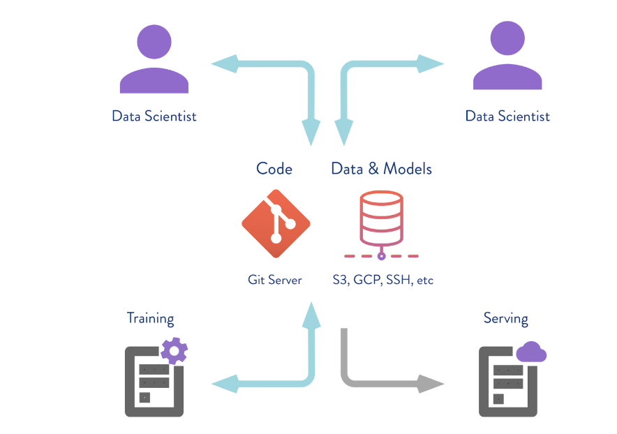

# Get Started with DVC

## **👀 Overview**

If you're just starting out with DVC, good examples and documentation will come in handy!

In this tutorial, we'll go through the basics of installing and getting started with DVC! By the way, DVC has excellent [documentation](https://dvc.org/doc/start).

🧑‍💻 [Repository for this tutorial](https://github.com/mlrepa/dvc-1-get-started)

!!! note "Important"
    - Instructions for setting up the environment are in the repository's README.

## **🎯 Goals**

- Overview DVC features and benefits for ML projects
- Explain basic concepts

## **⚒️ Tutorial: Get Started with DVC**

### **Initialize DVC**

At this stage, it is assumed that you have successfully:

- Cloned the repository ⬆️
- Installed DVC and other dependencies (see README)

DVC requires Git to work. DVC uses Git to store metadata about data and model versions. If you have cloned the repository, Git is already set up for the tutorial. Let's assume that is the case.

Let's create a DVC project by initializing DVC in the Git repository:

```bash
dvc init
```

A `.dvc` folder will appear in your repository. Let's take a look inside:

```bash
ls -a .dvc
```

The contents of `.dvc` will look something like this:

```bash
./      
../     
.gitignore  
cache/  
config
```

- `config` is the DVC configuration file.
- `cache` is a system folder where DVC will store all the data and models that you version.

*References:*

- [Get Started with DVC](https://dvc.org/doc/get-started/initialize)

### **Commit changes**

After initializing DVC, you need to add the DVC project setup to Git history:

```bash
git add .
git commit -m "Initialize DVC"
```

### **Data Versioning**

Run the data loading script:

- The data will be saved in `data/iris.csv`.

```bash
python src/load_data.py 
```

You can get a list of files in the `data/` folder using the command:

```bash
du -sh data/*
```

**Add the data file to DVC control**

```bash
dvc add data/iris.csv
```

You can get a list of files in the `data/` folder using the command:

```bash
du -sh data/*
```

Now, a new file `data/iris.csv.dvc` will appear in the `data/` folder.

- This file contains metadata that DVC uses to track the state (versions) of the `data/iris.csv` file.

```bash
4.0K    data/iris.csv
4.0K    data/iris.csv.dvc
```

Next, add this metadata file to the Git history:Далее, необходимо добавить этот файл с метаданными в историю  Git: 

```bash
git add .
git commit -m "Add a source dataset"
```

**DVC files contain metadata about artifact versions**

Let's take a look inside:

```bash
cat data/iris.csv.dvc
```

???+ note "More details"

    Inside the generated DVC file, it stores a hash of the file with standard parameters. `outs` are the path to the file in the `.dvc` folder that we added under DVC control. DVC puts the data in the `.dvc/cache` and creates a link to this file in the working directory. This file can be added to the Git history, thus versioning it. DVC takes care of managing the actual data. The first two characters of the hash are used as a folder inside the cache, and the remaining characters are used as the name of the created file.
    
    
*References:* 

- [dvc.org site](http://dvc.org/) 
- [Get Started with DVC](https://dvc.org/doc/tutorial/define-ml-pipeline)

### **Machine Learning pipelines**

In addition to data versioning, we can create pipelines - chains of computations with dependencies between them. Here is a standard pipeline for training and evaluating a classifier:


We have input data that needs preprocessing, splitting into train and test sets, feature calculation, model training, and evaluation. This pipeline can be divided into separate stages. For example, we can separate the data loading and preprocessing stage, dataset splitting stage, evaluation stage, etc., and connect these chains together.

Let's create a pipeline with 4 stages:

- load_data
- extract features
- split dataset
- train
- evaluate

To do this, we'll use the `dvc stage add` command.

**Add a pipeline stage with `dvc stage add`**

```bash
dvc stage add \
    -n load_data \            # Stage name
    -d src/load_data.py \     # Path to the input dependency of the stage
    -o data/iris.csv \        # Path to the output of the stage
    python src/load_data.py   # Command to execute the stage
```

This command adds the `load_data` stage to the pipeline. 

The stage name is `load_data`, the input dependency is the `src/load_data.py` file, the output is the `data/iris.csv` file, and the command `python src/load_data.py` is used to execute the stage.

When you run the `dvc stage add` command, it will add the stage configuration to the `dvc.yaml` file. This file contains the pipeline configuration in YAML format, including the stages, their dependencies, outputs, and commands. You can modify this file manually to make changes to your pipeline configuration.

To view the contents of `dvc.yaml` from the console, you can use the `cat` command:

```bash
cat dvc.yaml
```

This command will display the content of the `dvc.yaml` file in the console. If you have added only one stage so far, you will see the configuration for that stage within the file.

### **Build end-to-end ML pipeline**

Let’s create other stages 

```bash
dvc stage add \
    -n feature_extraction \
    -d src/featurization.py \
    -d data/iris.csv \
    -o data/iris_featurized.csv \
    python src/featurization.py
```

```bash
dvc stage add \
    -n split_dataset \
    -d src/split_dataset.py \
    -d data/iris_featurized.csv \
    -o data/train.csv \
    -o data/test.csv \
    python src/split_dataset.py --test_size 0.4

```

```bash
dvc stage add \
    -n train \
    -d src/train.py \
    -d data/train.csv \
    -o data/model.joblib \
    python src/train.py

```

```bash
dvc stage add \
    -n evaluate \
    -d src/train.py \
    -d src/evaluate.py \
    -d data/test.csv \
    -d data/model.joblib \
    -m data/eval.txt \          
    python src/evaluate.py

```

After running all the commands, the `dvc.yaml` file will contain the complete configuration of the pipeline, which specifies the stages to be executed. 

Additionally, DVC creates another file called `dvc.lock`. This file is a technical and extended version of `dvc.yaml`, containing information about the versions of input and output dependencies (file hashes).

When you execute the pipeline using DVC, it analyzes the hashes of the input and output dependencies and builds a Directed Acyclic Graph (DAG) of the stages. The DAG represents the order in which the stages should be executed to satisfy the dependencies. DVC uses this DAG to ensure that each stage is executed in the correct sequence and only when its dependencies are up to date.

### **Run and reproduce pipelines**

In this tutorial, we will execute the pipeline using the `dvc exp run` command 

```bash
dvc exp run
```

After running the pipeline, it is necessary to commit the changes:

```bash
git add .
git commit -m "Create DVC pipeline"
```

To rerun (reproduce) the pipeline, you can use the same command. However, if you run it in the current state without any changes, DVC will not detect any modifications and will not rerun the pipeline. But if you make changes to any of the input dependencies specified with `-d`, DVC will automatically detect the change and rerun the pipeline from that point onwards. The `dvc exp run` command provides enhanced capabilities for managing and reproducing ML experiments.

Alternatively, you can force to rerun all stages using the `-f` flag:

```bash
dvc exp run -f
```

By specifying the `-f` flag, DVC will rerun all the preceding stages and show a warning that it is removing previous versions of data that were tracked.

!!! note "Important"
    - Each time DVC reruns a stage, it deletes the previous cache and **overwrites it** to avoid duplicating data.
    - At the moment of running the DVC file, it checks its hash, and if it has changed, the pipeline is rerun, overwriting all the outputs associated with that stage.
    - If you want to avoid this, you need to push a specific version of the data to a remote repository beforehand.

## **Collaborate on ML Experiments**



DVC can work not only with local storage but also with remote storage repositories. By executing the `dvc push` command, DVC will send the current version of the model and data to the preconfigured remote storage repository. If your colleague clones the repository and executes the `dvc pull` command, they will obtain the specific version of the data and models that are intended for that branch. The key requirement is that everyone has access to the remote repository.


In this tutorial, we are simulating "remote" storage in the `tmp/dvc` folder. Similarly, remote storage can be set up in the cloud. 

### **Create remote storage (local)**

1. First, create the `/tmp/dvc` folder (you can replace it with any convenient path).

```bash
dvc remote add -d local /tmp/dvc
```
2. Now we can execute `dvc push` to send the data to this storage.

```bash
dvc push
```
3. Next, let's try manually deleting the model in the project repository and "restore" it using DVC:

```bash
dvc pull
```

So far, we have explored three situations where DVC and its main functionality are useful:

- **Data and model versioning**: If you don't need pipelines or remote repositories, you can still version data for a specific project while working on your local machine. DVC enables efficient data management, even for datasets spanning several gigabytes.
- **Data and model exchange among teams**: Cloud-based solutions can be used to store data. This is a convenient option when you have a distributed team or face limitations on file sizes sent via email. This approach can also be used when sharing notebooks that require access to large datasets.
- **Team collaboration within a large server**: Teams can work with a local version of large datasets, avoiding unnecessary data transfers. Instead, they can utilize a single remote storage, which will send and store only critical versions of models or data.

DVC provides a flexible and powerful set of features to streamline data versioning, collaboration, and pipeline management in various scenarios.

 

## **🏁 Conclusion**

In this tutorial, we explored the basics of using DVC (Data Version Control) to manage data and model versioning, as well as creating pipelines for machine learning projects. Here's a summary of what we covered:

1. **Initializing DVC**: We started by initializing DVC in our project repository, which allowed us to track and manage data and model versions using Git.
2. **Committing Changes**: After initializing DVC, we committed the DVC project setup to the Git history, ensuring that the changes are tracked and recorded.
3. **Data Versioning**: We learned how to add data files to DVC control using the `dvc add` command. DVC tracked the metadata and versions of the data files, enabling us to easily manage and reproduce experiments.
4. **Creating a Pipeline**: We created a pipeline with multiple stages using the `dvc stage add` command. Each stage represented a specific task or computation in the ML workflow, and we defined the dependencies between stages.
5. **Running and Reproducing the Pipeline**: We executed the pipeline using the `dvc repro` command, which ran the stages in the correct order based on their dependencies. We also learned how to rerun the pipeline when changes occur in the input dependencies.
6. **Remote Storage and Collaboration**: We explored the concept of remote storage in DVC, which allows us to push and pull data and models to and from a remote repository. This facilitates collaboration among team members by ensuring everyone has access to the same version of the data and models.

DVC provides powerful capabilities for data versioning, pipeline management, and collaboration in machine learning projects. By using DVC, data scientists and ML engineers can easily track and manage their data and models, reproduce experiments, and collaborate effectively within teams. With its seamless integration with Git and support for remote storage, DVC enables efficient and reproducible machine learning workflows.

By mastering the fundamentals covered in this tutorial, you are now equipped with the knowledge to leverage DVC effectively in your data science projects. Happy versioning and pipeline building with DVC!

## **🎓 Additional Resources**

1. **[DVC Official Documentation](https://dvc.org/doc)**: The official documentation is a comprehensive resource that provides detailed information about various DVC features, commands, and best practices. It includes tutorials, examples, and reference guides.
2. **[DVC YouTube Channel](https://www.youtube.com/c/DvcOrg)**: The DVC YouTube channel hosts a collection of tutorial videos, presentations, and demos that cover different aspects of using DVC for data versioning and pipeline management. It's a great visual resource to enhance your understanding.
3. **[Getting Started With DVC (DAGsHub)](https://dagshub.com/blog/getting-started-with-dvc/)**

!!! info " Contribute to the community! 🙏🏻 "

    Hey! We hope you enjoyed the tutorial and learned a lot of useful techniques 🔥 
    
    Please 🙏🏻 take a moment to improve our tutorials and create better learning experiences for the whole community. You could
 
    - ⭐ **Put a star on our [ML REPA library repository](https://github.com/mlrepa/mlrepa-library)** on GitHub
    - 📣 **Share our tutorials** with others, and
    - :fontawesome-solid-paper-plane: **Fill out the [Feedback Form](https://forms.gle/Yc9DmampbwFpEzo58)**
    We would appreciate any suggestions or comments you may have

    Thank you for taking the time to help the community! 👍

