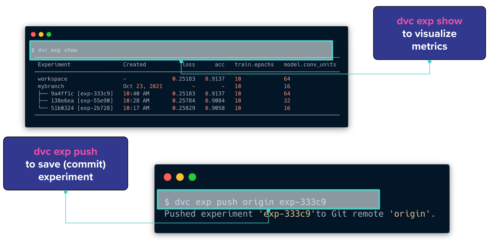
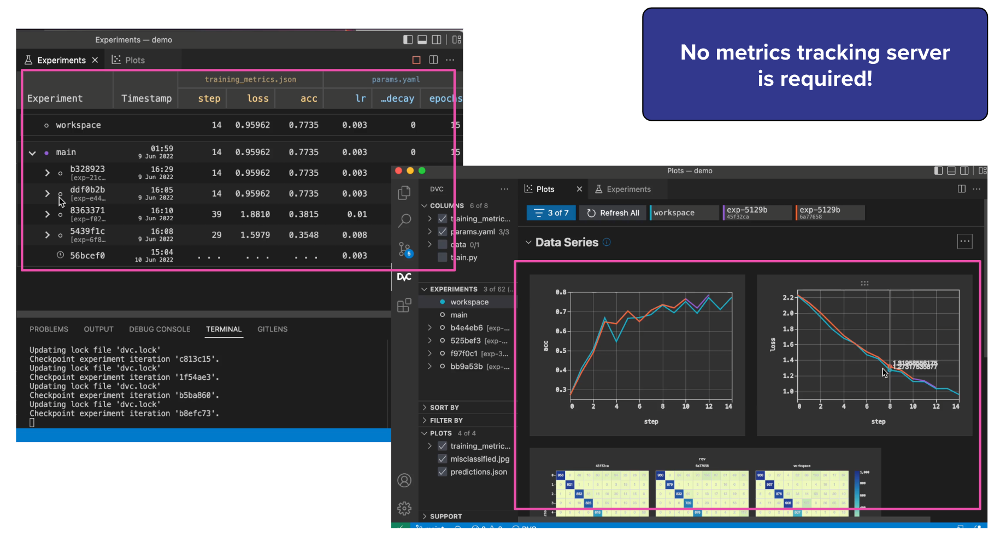

# Automate ML experiments with DVC

## **👀 Overview**

This tutorial provides a comprehensive demonstration of approaches to automate machine learning experiments using DVC (Data Version Control).

🧑‍💻 [Repository for this tutorial](https://gitlab.com/mlrepa/dvc-101/dvc-3-automate-experiments)

!!! note "Important"
    - Instructions for setting up the environment are in the repository's README.

## **🎯 Goals**

- Learn pipelines automation features of DVC

## **Tutorial: Automate ML experiments with DVC**

### **Installation**

To conveniently view the structure of files and directories in the terminal, the `tree` utility can be useful. Here's how to install it on Linux:

1. Open the terminal.
2. Ensure that your system has internet access.
3. Enter the following command to install `tree`:
    
    ```bash
    # for Linux 
    sudo apt-get install tree
    
    # for Mac
    brew install tree
    ```
    
4. When prompted, enter the administrator (root) password.
5. Wait for the installation to complete.

Once the installation is finished, you can use the `tree` command to view the structure of files and directories in the terminal. Here's an example usage:

```bash
tree <directory_path>
```

Replace `<directory_path>` with the path to the directory you want to view.

### **Prepare repository**

To clone the example repository, you can follow these steps:

```bash
git clone https://github.com/mlrepa/dvc-3-automate-experiments 
```

Checkout branch `tutorial`

```bash
git checkout -b tutorial
```

Initialize DVC

```bash
dvc init
git add .dvc
git commit -m "DVC init"
```

### **Create DVC pipeline**

**1 - Create `data_load` stage**

To create a `dvc.yaml` file and add the `data_load` stage to it, follow the instructions below:

1. Create a new file called `dvc.yaml` in your project directory.
2. Open the `dvc.yaml` file in a text editor and add the following content:

```yaml
	data_load:
	  cmd: python src/data_load.py --config=params.yaml
	  deps:
	  - src/data_load.py
	  params:
	  - data_load
	  outs:
	  - data/classes.json
	  - data/iris.csv
```

Explanation of the `data_load` stage configuration:

- `data_load` is the name of the stage.
- `cmd` specifies the command to run for this stage. In this case, it runs the `data_load.py` script with the `-config=params.yaml` argument.
- `deps` lists the dependencies of this stage. Here, it includes `src/data_load.py`, indicating that if this file changes, the stage will be re-executed.
- `params` specifies the parameters for this stage. In this example, it includes a single parameter called `data_load`.
- `outs` lists the outputs generated by this stage. Here, it includes `data/classes.json` and `data/iris.csv`, indicating that these files will be produced as output by the stage.

The `dvc.yaml` file is now ready with the `data_load` stage defined. You can run the pipeline or continue adding more stages.

**2 - Run the pipeline**

Run or reproduce the pipeline using the following command:

```bash
dvc exp run 
```

This command will execute the pipeline stages defined in the `dvc.yaml` file. DVC will analyze the dependencies and execute the stages in the correct order.

Check the size of the data directory:

```bash
du -sh data/*
```

View the directory structure:

```bash
# Note: we use `tree -I ...` pattern to not list those files that match the wild-card pattern.

tree -I .venv
```

### **Build end-to-end Machine Learning pipeline**

To build an end-to-end machine learning pipeline, you need to add stages for feature extraction, dataset splitting, training, and evaluation.

**3 - Add feature extraction stage** 

Update the `dvc.yaml` file with the `feature_extraction` stage:

```yaml
	feature_extraction:
	  cmd: python src/featurization.py --config=params.yaml
	  deps:
	  - data/iris.csv
	  - src/featurization.py
	  params:
	  - data_load
	  - featurize
	  outs:
	  - data/iris_featurized.csv
```

**4 - Add split train/test stage**

Update the `dvc.yaml` file with the `split_dataset` stage:

```yaml
	split_dataset:
	  cmd: python src/split_dataset.py --config=params.yaml
	  deps:
	  - data/iris_featurized.csv
	  - src/split_dataset.py
	  params:
	  - data_split
	  - featurize
	  outs:
	  - data/test.csv
	  - data/train.csv
```

**5 - Add train stage**

Update the `dvc.yaml` file with the `train` stage:

```yaml
	train:
	  cmd: python src/train.py --config=params.yaml
	  deps:
	  - data/train.csv
	  - src/train.py
	  params:
	  - data_split
	  - train
	  outs:
	  - data/model.joblib
```

**6 - Add evaluate stage**

Update the `dvc.yaml` file with the `evaluate` stage:

```yaml
	evaluate:
	  cmd: python src/evaluate.py --config=params.yaml
	  deps:
	  - data/classes.json
	  - data/model.joblib
	  - data/test.csv
	  - src/evaluate.py
	  params:
	  - data_load
	  - data_split
	  - evaluate
	  - train
	  metrics:
	  - data/metrics.json
	  plots:
	  - data/cm.csv
```

???+ example "Final version of the `dvc.yaml` "

    ```yaml
    stages:
      
    	data_load:
    	  cmd: python src/data_load.py --config=params.yaml
        deps:
        - src/data_load.py
        params:
        - data_load
        outs:
        - data/classes.json
        - data/iris.csv
    
      feature_extraction:
        cmd: python src/featurization.py --config=params.yaml
        deps:
        - data/iris.csv
        - src/featurization.py
        params:
        - data_load
        - featurize
        outs:
        - data/iris_featurized.csv
    
      split_dataset:
        cmd: python src/split_dataset.py --config=params.yaml
        deps:
        - data/iris_featurized.csv
        - src/split_dataset.py
        params:
        - data_split
        - featurize
        outs:
        - data/test.csv
        - data/train.csv
    
      train:
        cmd: python src/train.py --config=params.yaml
        deps:
        - data/train.csv
        - src/train.py
        params:
        - data_split
        - train
        outs:
        - data/model.joblib
    
      evaluate:
        cmd: python src/evaluate.py --config=params.yaml
        deps:
        - data/classes.json
        - data/model.joblib
        - data/test.csv
        - src/evaluate.py
        params:
        - data_load
        - data_split
        - evaluate
        - train
        metrics:
        - data/metrics.json
        plots:
        - data/cm.csv
    ```

**Run DVC pipeline**
Execute the following command to run the DVC pipeline:

```bash
dvc exp run 
```

This command will execute the pipeline stages defined in the `dvc.yaml` file. DVC will analyze the dependencies and execute the stages in the correct order.

**Commit changes**

Once the pipeline execution is complete and you are satisfied with the results, commit the changes to Git using the following commands:

```bash
# Commit changes

git add .
git commit -m "Complete DVC pipeline"
```

This will create a new commit in your Git repository, capturing the changes made during the DVC pipeline execution. It allows you to keep track of the pipeline changes and easily revert to previous versions if needed.

### **Experimenting with reproducible pipelines**

The `dvc.yaml` and `dvc.lock` files serve as a blueprint for your pipeline, ensuring that each time you run the pipeline, the same data and commands are used, leading to reproducible results. This is essential in machine learning and data science, as it enables you to track the evolution of your experiments and easily reproduce them when needed.

By combining Git's version control capabilities with DVC's data versioning and pipeline management, you have a powerful solution for reproducible and collaborative data science workflows.

### **Experiment 1: Add features**

In this experiment, we will add new features to the dataset by modifying the `featurization.py` file.

First, we create a new branch called `exp1-ratio-features` to isolate the changes for this experiment:

```bash
git checkout -b exp1-ratio-features
git branch
```

Next, we update the `featurization.py` file. Inside the `get_features()` function, after the line `features = get_features(dataset)`, we add the following lines to calculate two new ratio features:

```python
features['sepal_length_to_sepal_width'] = features['sepal_length'] / features['sepal_width']
features['petal_length_to_petal_width'] = features['petal_length'] / features['petal_width']
```

After making the changes, we create an experiment using the `dvc exp run` command with the name `-n exp1-ratio-features`:

```bash
dvc exp run -n exp1-ratio-features
```

To compare the metrics of this experiment with the previous pipeline run, we use the `dvc metrics diff --all` command:

```
dvc metrics diff --all
```

Finally, we commit the changes for this experiment:

```bash
git add .
git commit -m "Experiment with new features"
git tag -a "exp1_ratio_features" -m "Experiment with new features"

```

By creating a separate branch and using DVC experiments, we can easily track and manage different versions of our pipeline and evaluate the impact of specific changes on our results.

### **Experiment 2: Tune Logistic Regression**

In this experiment, we will tune the hyperparameters of the Logistic Regression model in the `train.py` file.

First, we create a new branch called `exp2-tuning-logreg` to isolate the changes for this experiment:

```bash
git checkout -b exp2-tuning-logreg
git branch

```

Since we have already checked out the code and data files in the previous experiment, there is no need to reproduce the pipeline. We can directly proceed to tuning the parameters.

In the `train.py` file, we update the hyperparameters of the Logistic Regression model. We replace the existing parameters with the following values:

```python
clf = LogisticRegression(
		C=0.01,
		solver='lbfgs',
		multi_class='multinomial',
		max_iter=100,
		random_state=config.base.random_state
)
```

Here, we specifically set the `C` parameter to 0.01.

To create the experiment, we use the `dvc exp run` command with the name `-n exp2-tuning-logreg`:

```
dvc exp run -n exp2-tuning-logreg
```

We can examine the difference in metrics compared to the previous pipeline run using the following commands:

```bash
cat data/metrics.json

```

```bash
dvc metrics show
```

```bash
dvc exp diff --all
```

Finally, we commit the changes for this experiment:

```bash
git add .
git commit -m "Tune model. LogisticRegression. C=0.01"
git tag -a "exp2_tuning_logreg" -m "Tune model. LogisticRegression. C=0.01"
```

By creating separate experiment branches and modifying the hyperparameters, we can evaluate the impact of different parameter settings on the performance of our model. This allows us to systematically explore different configurations and select the best performing model for our task.

### **Experiment 3: Use SVM**

In this experiment, we will switch from using the Logistic Regression model to the Support Vector Machine (SVM) model in the `train.py` file.

First, we create a new branch called `exp3-svm` to isolate the changes for this experiment:

```bash
git checkout -b exp3-svm
```

Next, we update the `train.py` file by replacing the lines for the Logistic Regression model with the following lines for the SVM model:

```python
clf = SVC(
		C=0.1,
		kernel='linear',
		gamma='scale',
		degree=5,
		random_state=config.base.random_state
)
```

Here, we set the hyperparameters for the SVM model, including the `C` parameter, the kernel type (`linear`), the gamma value (`scale`), and the degree of the polynomial kernel (5).

To create the experiment, we use the `dvc exp run` command with the name `-n exp3-svm`:

```bash
dvc exp run -n exp3-svm
```

We can view the metrics for this experiment using the `dvc metrics show` command:

```bash
dvc metrics show
```

Finally, we commit the changes for this experiment:

```bash
git add .
git commit -m "Experiment 3 with SVM estimator"
git tag -a "exp3_svm" -m "Experiment 3 with SVM estimator"
```

By switching to the SVM model and evaluating its performance, we can compare it with the previous experiments using Logistic Regression. This allows us to explore different models and assess their suitability for the task at hand.

### **Compare experiments and metrics in CLI**

<figure markdown>
  { width="700" height="300" }
    <figcaption>
    Source: https://iterative.ai/blog/DVC-VS-Code-extension/
    </figcaption>
</figure>

To visualize the metrics and results of the experiments, you can use the `dvc exp show` command. This command provides a detailed overview of the experiment, including the metrics, parameters, and other relevant information.

To save or commit the experiment and its results, you can use the `dvc exp push` command. This command saves the experiment and its associated data, metrics, and parameters, allowing you to track and share the experiment with others.

### **Use VSCode extension for DVC**

Additionally, you can refer to the **[DVC VS Code extension](https://iterative.ai/blog/DVC-VS-Code-extension)** for an enhanced integration of DVC with Visual Studio Code. The extension provides a graphical interface and features to streamline the usage of DVC within the VS Code environment, making it more convenient to manage experiments and version control for your machine learning projects.

<figure markdown>
  { width="700" height="300" }
    <figcaption>
    Source: https://iterative.ai/blog/DVC-VS-Code-extension/
    </figcaption>
</figure>

## **🏁 Conclusion**

In this tutorial, we explored how to use DVC (Data Version Control) for reproducible and version-controlled machine learning pipelines. We learned about the key concepts of DVC, such as data versioning, pipeline creation, and experiment management. We saw how DVC integrates with Git to provide a comprehensive solution for data and model versioning.

By using DVC, we can track changes to our data, create data pipelines with dependencies, and easily reproduce experiments. DVC helps in managing large datasets efficiently by storing only the differences between versions and leveraging remote storage options for collaboration and sharing.

Throughout the tutorial, we covered the following topics:

- Setting up DVC and initializing a project
- Tracking data and models with DVC
- Creating data pipelines using DVC stages
- Running and reproducing pipelines with `dvc exp run`
- Switching between different versions of data and models
- Using remote storage with DVC to store and retrieve data
- Experimenting with different pipeline configurations and hyperparameters
- Visualizing and saving experiments with DVC

With DVC, we have a powerful tool to ensure reproducibility, collaboration, and version control in our machine learning projects. By leveraging DVC's features, we can streamline our workflow, improve experiment management, and facilitate collaboration with team members.

## **🎓 Additional Resources**

To further enhance your understanding of DVC and explore more advanced topics, consider checking out the following resources:

1. [DVC Documentation](https://dvc.org/doc/start): The official documentation provides comprehensive information on DVC's features, concepts, and usage. It includes detailed guides, tutorials, and reference materials.
2. [DVC YouTube Channel](https://www.youtube.com/c/DVCorg): The DVC YouTube channel features a collection of video tutorials, demos, and talks on various aspects of DVC. It's a great resource to visually learn about DVC's capabilities.
3. [DVC Forum](https://discuss.dvc.org/): The DVC Forum is a community-driven platform where you can ask questions, share ideas, and engage in discussions related to DVC. It's a valuable resource for seeking assistance and connecting with other DVC users.

By exploring these additional resources, you can deepen your knowledge of DVC and unlock its full potential for managing data and models in your machine learning projects.

!!! info " Contribute to the community! 🙏🏻 "

    Hey! We hope you enjoyed the tutorial and learned a lot of useful techniques 🔥 
    
    Please 🙏🏻 take a moment to improve our tutorials and create better learning experiences for the whole community. You could
 
    - ⭐ **Put a star on our [ML REPA library repository](https://github.com/mlrepa/mlrepa-library)** on GitHub
    - 📣 **Share our tutorials** with others, and
    - :fontawesome-solid-paper-plane: **Fill out the [Feedback Form](https://forms.gle/Yc9DmampbwFpEzo58)**
    We would appreciate any suggestions or comments you may have

    Thank you for taking the time to help the community! 👍

