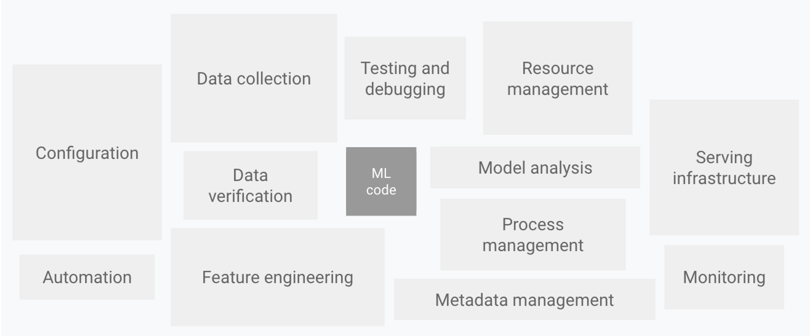
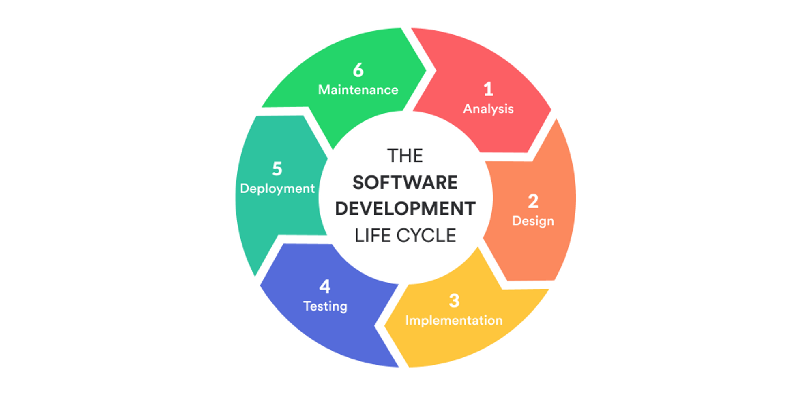
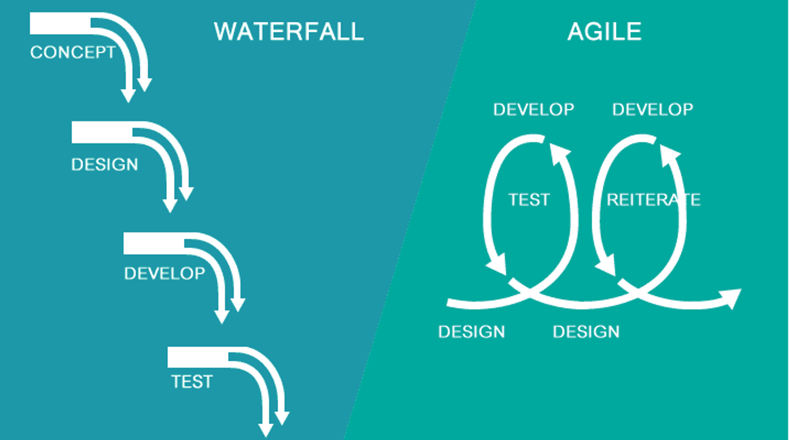
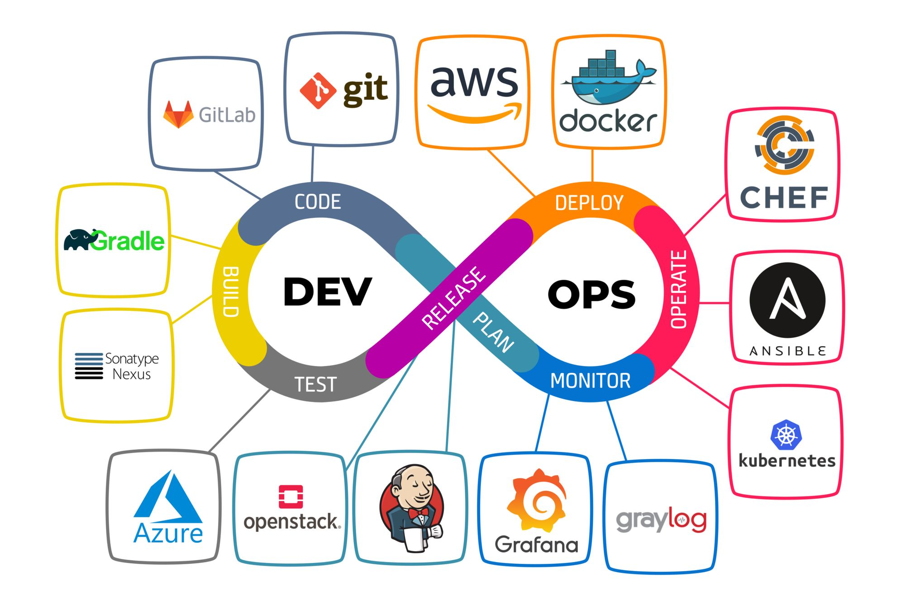
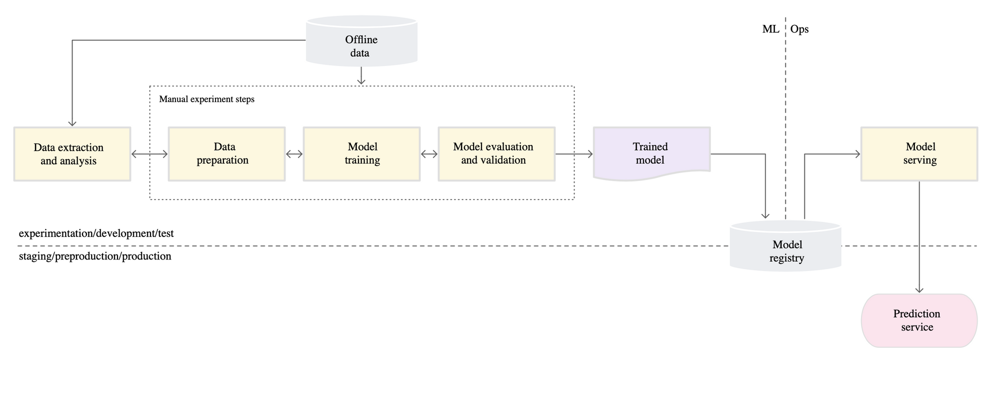
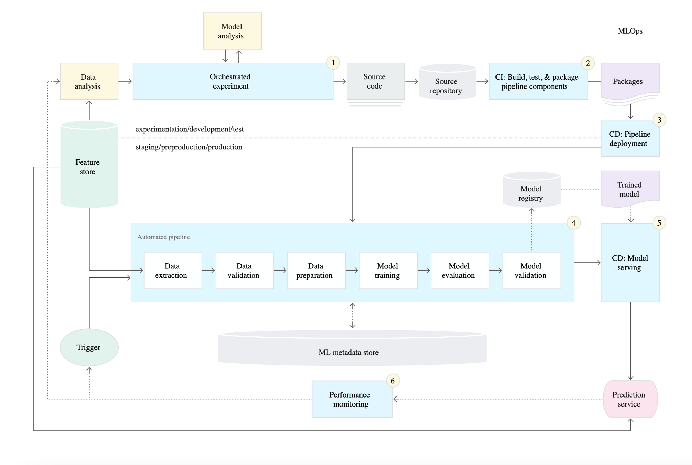
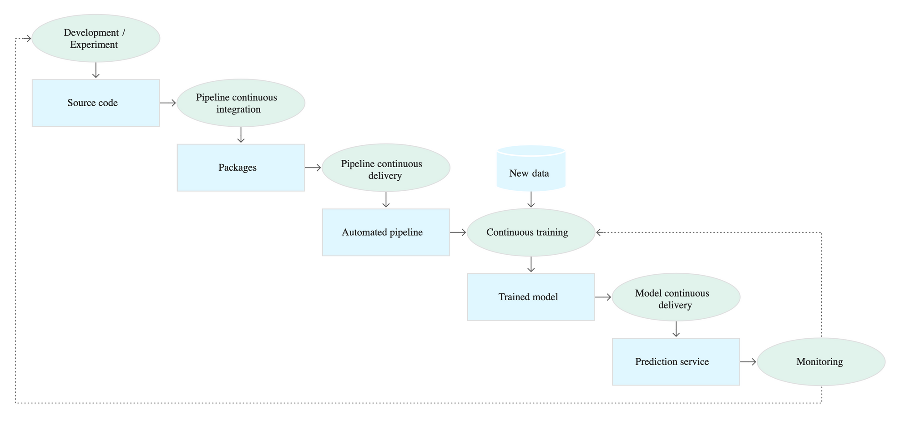
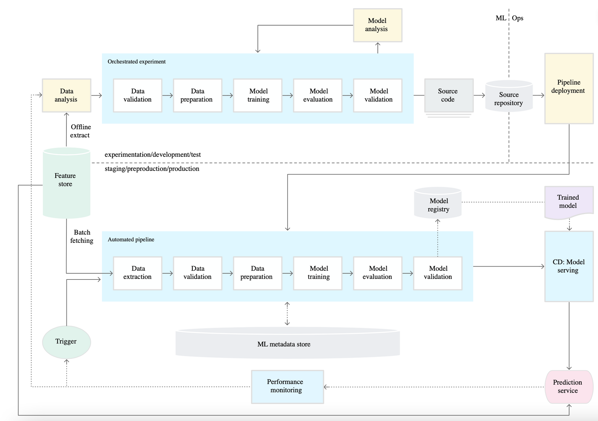

# Intro to Production ML and MLOps

## **👀 Overview**

**Machine Learning Engineering (MLE)** involves applying scientific principles, tools, and techniques from machine learning and traditional software engineering to design and build complex computing systems. 

The **Production ML**  focuses on the practical aspects of deploying machine learning models into production environments. It covers the challenges and best practices involved in building, testing, deploying, and monitoring ML systems. 

**MLOps** emphasizes the importance of standardizing processes and technology capabilities to enable rapid and scalable deployment and operation of ML systems.

## **🎯 Goals**

1. Understand the challenges and considerations involved in deploying ML models in production, including technical debt, data quality, and model performance.
2. Learn about the software development life cycle (SDLC) and project management methodologies for effective ML development and deployment.
3. Gain knowledge of DevOps principles and practices and how they can be applied to ML systems for continuous integration, delivery, and automation.
4. Explore the concept of MLOps and its role in standardizing processes and technology capabilities for building, deploying, and operationalizing ML systems.

## **⚒️ Production ML**

<figure markdown>
  { width="700" height="400" }
    <figcaption>
    Source: ["Hidden Technical Debt in Machine Learning Systems" paper](https://papers.nips.cc/paper/2015/file/86df7dcfd896fcaf2674f757a2463eba-Paper.pdf)
    </figcaption>
</figure>

**Technical Debt** refers to accumulated problems in software code or architecture that arise from neglecting software quality during development, resulting in additional future work and costs.

**ML systems** have additional "opportunities" to accumulate technical debt, and ML Engineers often face these challenges **primarily**.

For example, unstable data dependencies, feedback loops, glue code, pipeline jungles, dead experimental code paths, fixed thresholds in dynamic systems, entanglement (CACE principle), etc.

ML systems differ from other software systems in the following ways:

- **Team Qualification**: Data Scientists and ML Researchers may lack experience in building production services.
- **Development**: ML models require constant experimentation. The challenge lies in tracking and reproducing results while maintaining code flexibility and reusability.
- **Testing**: In addition to regular testing, we need to ensure data quality, model quality, and the adequacy of their performance.
- **Deployment**: ML deployment involves deploying not just the ML model but an entire ML pipeline that trains and deploys the model.
- **Production**: Unlike regular software, ML models become obsolete as data continuously evolves.

### **Software Development Life Cycle (SDLC) in ML**

SDLC encompasses a set of processes that guide the entire software development journey. It starts with capturing the initial idea, documenting requirements, and progresses through various stages until the delivery of the finished software. Following the SDLC framework is essential for successful software delivery.

<figure markdown>
  { width="700" height="400" }
    <figcaption>
    Source: [Software Development Life Cycle (SDLC)](https://www.winklix.com/blog/wp-content/uploads/2019/09/edf02cb0ab3634c4944fb286c4fcd6926c058666.png)
    </figcaption>
</figure>

**Benefits of Applying ML in SDLC**

- **Project Planning and Estimation**: ML can assist in project planning, scheduling, and estimation, leading to more accurate timelines and resource allocation.
- **Project Progress Tracking**: ML techniques can provide insights and analytics to track project progress, identify bottlenecks, and mitigate risks effectively.
- **Development Speed**: ML can automate repetitive tasks, improve productivity, and accelerate the development process.
- **Project Management**: ML-powered tools can enhance project management by streamlining workflows, facilitating collaboration, and improving communication.
- **Quality Assurance**: ML algorithms can be used for automated testing, identifying bugs, and ensuring software quality.
- **Predictive Maintenance**: ML models can be applied to monitor software performance, identify potential issues, and enable proactive maintenance.
- **User Experience Enhancement**: ML techniques can personalize user experiences, recommend relevant features, and improve user satisfaction.
- **Decision Support**: ML can analyze data and provide valuable insights to support decision-making throughout the SDLC.

### **Project Management Methodologies**

<figure markdown>
  { width="700" height="400" }
    <figcaption>
    Source: [Waterfall or Agile](https://blog.planview.com/waterfall-or-agile/)
    </figcaption>
</figure>

Common project management [methodologies for ML projects](https://neptune.ai/blog/data-science-project-management):

- Waterfall methodology
- Agile methodology
- Hybrid methodology
- R&D methodology

### **DevOps**

DevOps is a set of practices that combines software development (Dev) and IT infrastructure and service management (Ops). The goal of DevOps is to shorten the development cycle and ensure continuous delivery of high-quality updates.

**Key DevOps Aspects**

- Coding – code development and review, source code management tools, code merging.
- Building – continuous integration tools, build status.
- Testing – continuous testing tools that provide quick and timely feedback on business risks.
- Packaging – artifact repository, application pre-deployment staging.
- Releasing – change management, release approvals, release automation, continuous deployment tools.
- Configuring – infrastructure configuration and management, infrastructure as code tools.
- Monitoring – application performance monitoring, end-user experience.

**DevOps Toolchain**

<figure markdown>
  { width="700" height="400" }
    <figcaption>
    Source: [What is DevOps and where is it applied](https://www.shalb.com/blog/what-is-devops-and-where-is-it-applied/)
    </figcaption>
</figure>

ML and other software systems are similar in continuous integration of source control, unit testing, integration testing, and continuous delivery of software modules or packages. However, in ML, there are a few notable differences:

- CI is no longer only about testing and validating code and components, but also about testing and validating data, data schemas, and models.
- CD is no longer about a single software package or service but about a system (ML training pipeline) that should automatically deploy another service (model prediction service).
- CT is a new property unique to ML systems that focuses on automatically retraining and serving the models.

[MLOps: Continuous delivery and automation pipelines in machine learning](https://cloud.google.com/solutions/machine-learning/mlops-continuous-delivery-and-automation-pipelines-in-machine-learning)

## **MLOps**

Sometimes MLOps is defined as the extension of the DevOps methodology to include Machine Learning and Data Science assets as first-class citizens within the DevOps ecosystem.  However, it is important to note that MLOps encompasses a broader scope and covers various aspects of ML system development, deployment, and maintenance.

MLOps incorporates principles, practices, and technologies that aim to streamline the entire ML lifecycle, including data preparation, model training, deployment, monitoring, and retraining. It encompasses the integration of ML workflows, models, and data pipelines into the DevOps ecosystem, treating them as first-class citizens.

> **MLOps** is a set of standardized processes and technology capabilities for building, deploying, and operationalizing ML systems rapidly and reliably           
*Source: [Practitioners Guide to MLOps (Google)](https://services.google.com/fh/files/misc/practitioners_guide_to_mlops_whitepaper.pdf)* 

**What MLOps Should Do?**

- Strive to unify the ML release cycle and the software application release cycle.
- Automate testing of ML artifacts.
- Apply Agile principles to ML projects.
- Integrate ML artifacts into CI/CD systems.
- Reduce technical debt associated with ML usage.

### **MLOps Level 0: Manual Process**

<figure markdown>
  { width="700" height="400" }
    <figcaption>
    Source: [MLOps: Continuous delivery and automation pipelines in ML](https://cloud.google.com/solutions/machine-learning/mlops-continuous-delivery-and-automation-pipelines-in-machine-learning)
    </figcaption>
</figure>

### **MLOps Level 1: Automation of ML pipeline**

<figure markdown>
  { width="700" height="400" }
    <figcaption>
    Source: [Automation of ML pipeline](https://i.imgur.com/PiF2cCl.png)
    </figcaption>
</figure>

### **MLOps Level 2: Automation of CI/CD pipeline**

<figure markdown>
  { width="700" height="400" }
    <figcaption>
    Source: [Automation of CI/CD pipeline](https://i.imgur.com/9262z9p.png)
    </figcaption>
</figure>

### **MLOps - Final Pipeline**

<figure markdown>
  { width="700" height="400" }
    <figcaption>
    Source: [Final Pipeline](https://i.imgur.com/1pDgIKU.png)
    </figcaption>
</figure>

## **🏁 Conclusion**

- DevOps is a set of practices that combines software development (Dev) and IT operations (Ops). It aims to shorten the systems development life cycle and provide continuous delivery with high software quality.
- Continuous Integration and Continuous Delivery are among the most important practices in DevOps.
- MLOps applies the DevOps approach to the development of ML systems, taking into account their specific requirements. Continuous Training is added as a practice due to the need for model updates.

## **🎓 Additional Resources**

- [The MLOps Blueprint](https://medium.com/slalom-data-analytics/the-modern-mlops-blueprint-c8322af69d21)
- [MLOps SIG](https://github.com/cdfoundation/sig-mlops/blob/master/roadmap/2020/MLOpsRoadmap2020.md)
- [Practitioners Guide to MLOps (Google)](https://services.google.com/fh/files/misc/practitioners_guide_to_mlops_whitepaper.pdf)
- [MLOps: Continuous delivery and automation pipelines in machine learning](https://cloud.google.com/solutions/machine-learning/mlops-continuous-delivery-and-automation-pipelines-in-machine-learning)
- [A peek into Agile DevOps](https://medium.com/@mainakdutta76/before-and-after-of-devops-a-peek-into-agile-devops-3600c26129ac)

!!! info " Contribute to the community! 🙏🏻 "

    Hey! We hope you enjoyed the tutorial and learned a lot of useful techniques 🔥 
    
    Please 🙏🏻 take a moment to improve our tutorials and create better learning experiences for the whole community. You could
 
    - ⭐ **Put a star on our [ML REPA library repository](https://github.com/mlrepa/mlrepa-library)** on GitHub
    - 📣 **Share our tutorials** with others, and
    - :fontawesome-solid-paper-plane: **Fill out the [Feedback Form](https://forms.gle/Yc9DmampbwFpEzo58)**
    We would appreciate any suggestions or comments you may have

    Thank you for taking the time to help the community! 👍

