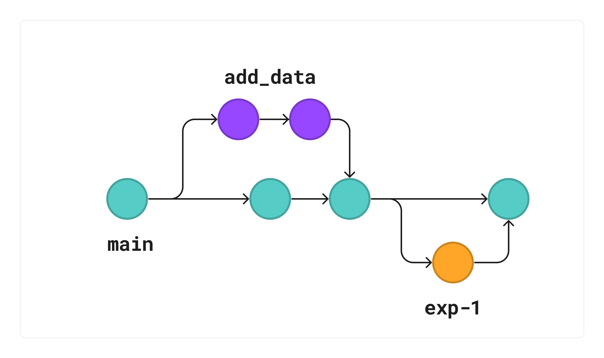

# Get started with Git 

## 👀 **Оverview**

This tutorial provides an introduction to Git, including its basic concepts, benefits, and how it can be used for version control in Machine Learning projects.

We will cover the basics of Git, such as creating a repository, making commits, branching, merging. Also, you can install Git and configure it for your machine at this stage. 

## 🎯 **Goals**

By the end of this tutorial you will: 

- Understand what Git is and why it's important for ML development
- Learn the basic concepts of version control, including repositories, commits, branches, and merges

## **Tutorial: Introduction to Git and version control**

### **1. What is Git and why is it important for ML development?**

**[Git](https://git-scm.com/)** is the most popular **version control system** in the world. And it records the changes made to our code over time in a special database.



We can look at our project history and see who has made changes, what changes, when and why. And if we screw something up we can easily revert our project back to an earlier state.

Without a version control system, we'll have to store copies of the entire project in various folders constantly. This is very slow and doesn't scale at all. Especially if multiple people have to work on the same project you would have to constantly toss around the latest code via email or some other mechanisms and then manually merge the changes.

So, with a version control system, you can

- Keep track of your code and files changes over time. So you have a record of what has been done, who made changes and who revert to specific versions
- Collaborate easier, because Git allow merging changes of multiple people into one source
- Experiment with different features and models without losing progress
- Handle different versions of the same code at the same time
- Take different versions of the same code, compare them, and assemble them together
- Create your own copy of a collection of files to modify your copy and suggest changes

<br>

**Why is Git important for machine learning development?**

Git as a version control system is crucial in ML development because it

- Helps avoid the pitfalls of manual version control for files, notebooks and models
- Keeps code organized and easy to manage
- Enables collaboration with other developers simultaneously without risking a loss of progress
- Allows for easy monitoring of project history, including who made what changes and when providing valuable insights into the development process.

### **2. Basic concepts of version control: repository, commit, branch, merge, etc.** 

To manage changes to code over time you should learn the basic concepts of version control. Watch the video to get an understanding of how Git works:

<br>

<figure class="video_container">
  <iframe src="https://www.youtube.com/embed/hwP7WQkmECE" frameborder="0" width="600" height="300" allowfullscreen="true" "Image Title" > </iframe>
  <figcaption>
     Git explained in 100 seconds
    </figcaption>
</figure>

Let’s summarise:

- **Repository** is a collection of files and folders that are managed by a version control system. It contains the entire history of the project, including all changes and versions of the code.

- **Commit** is a snapshot of the changes made to the code at a particular point in time. It records the changes to the files in the repository, along with a message describing the changes.

- **Branch.**  It is a separate version of the code within the same repository, and changes made in the branch are tracked separately from the main "master" branch. Branches are useful for experimenting with new features or fixing bugs without affecting the main codebase.

- **Merge.** Merging is the process of combining two or more branches into a single branch. It allows developers to bring changes from one branch into another and resolve any conflicts that arise.

- **Fork:** A fork is a separate copy of the entire repository, including all its branches, commits, and history created by a user. It allows the user to experiment with the code without affecting the original repository. Forks are commonly used in open source projects, where users can contribute changes back to the original repository through pull requests.

- **Pull/Merge request (PR/MR)**: A pull request is a request to merge changes from one branch into another. So you send the code updates. Then, other people look on your code, discuss it in the GitLab/ GitHub, and decide whether to merge or not

These concepts are fundamental to version control systems like Git, and understanding them is essential for effective collaboration and development in software development teams.  

### **3. Git installation**

The first step in using Git is to install it on your machine. Here are the steps to follow:

1. Go to the official [Git website](https://git-scm.com/downloads) and download the appropriate version for your operating system.
2. Follow the installation instructions provided on the Git website, or follow the videos below with the whole process of installation and configuration (for MacOS and Windows)

<figure class="video_container">
  <iframe src="https://www.youtube.com/embed/r3SgprWigBc" frameborder="0" width="600" height="300" allowfullscreen="true" "Image Title" > </iframe>
  <figcaption>
    Git installing and configuring on MacOS
    </figcaption>
</figure> 

<figure class="video_container">
  <iframe src="https://www.youtube.com/embed/j-g8AXr4nR4" frameborder="0" width="600" height="300" allowfullscreen="true" "Image Title" > </iframe>
  <figcaption>
     Git installing and configuring on Windows
    </figcaption>
</figure>

### **4. Git configuration**

After installing Git, you should configure your Git settings for your machine. This includes setting your name and email address, default text editor, and merge tool using the appropriate Git commands. 

Here are the steps to follow:

After installing Git, you should configure your Git settings for your machine. This includes setting your name and email address and setting the Git branch name to main. 

Here are the steps to follow:

1. Open a terminal or command prompt window and type the following commands to set your name and email address:

  ```bash
  git config --global user.name "Your Name"
  git config --global user.email "youremail@example.com"
  ```
2. Next, set the default Git branch name to main

  ```bash
  git config --global init.defaultBranch main
  ```
3. Verify that your Git settings are correct by typing the following command:

  ```bash
  git config --list
  ```

### **5. Setup SSH**
An SSH key is an access credential for the SSH (secure shell) network protocol. Using the SSH key to your Git configuration allows you to securely authenticate and interact with remote repositories (on GitHub or GitLab) without having to repeatedly enter your username and password. 

- [What is a Git SSH Key?](https://www.atlassian.com/git/tutorials/git-ssh)

**Generate an SSH key and add it to your Git account**

You can follow the video below to see the entire process. 
Here are all the steps:

1. Open a terminal or command prompt window and type the following command to generate an SSH key:
```
ssh-keygen
```
2. Follow the instructions provided in the setup wizard to generate your SSH key.
3. Once generated, add your public SSH key to your Git account by copying the **public** key from the terminal or command prompt and pasting it into the appropriate field in your Git account settings.
    
    a. [Add an SSH key to your GitLab account](https://docs.gitlab.com/ee/user/ssh.html#add-an-ssh-key-to-your-gitlab-account)

    b. [Add an SSH key to your GitHub account](https://docs.github.com/en/authentication/connecting-to-github-with-ssh/adding-a-new-ssh-key-to-your-github-account)

Also, you can look at more details in the documentation to [generate an SSH key pair](https://docs.gitlab.com/ee/user/ssh.html#generate-an-ssh-key-pair) or watch the video below.

<figure class="video_container">
  <iframe src="https://www.youtube.com/embed/Z3ELWci34cM" frameborder="0" width="600" height="300" allowfullscreen="true" "Image Title" > </iframe>
  <figcaption>
    Creating and adding your SSH Key (Windows, Mac and Linux)
    </figcaption>
</figure> 

## 🏁 **Conclusion**

Congratulations on completing this tutorial! 🥳

By now, you should have a solid understanding of what Git is and why it is important for machine learning development.

You have also learned the basic concepts of version control, including repository, commit, branch, merge, merge request/pull request (MR/PR), and fork.

See you on the next step! 

## 🎓 **Additional resources**

- **[Git documentation](https://git-scm.com/doc)**
- **[GitHub Guides](https://docs.github.com/en)**
- **[Atlassian Git tutorial](https://www.atlassian.com/git/tutorials)**
- **[Git cheat sheet](https://education.github.com/git-cheat-sheet-education.pdf)**
- **[Use SSH keys to communicate with GitLab](https://docs.gitlab.com/ee/user/ssh.html)**

!!! info " Contribute to the community! 🙏🏻 "

    Hey! We hope you enjoyed the tutorial and learned a lot of useful techniques 🔥 
    
    Please 🙏🏻 take a moment to improve our tutorials and create better learning experiences for the whole community. You could

    - ⭐ **Put a star on our [ML REPA library repository](https://github.com/mlrepa/mlrepa-library)** on GitHub 
    - 📣 **Share our tutorials** with others, and
    - :fontawesome-solid-paper-plane: **Fill out the [Feedback Form](https://forms.gle/Yc9DmampbwFpEzo58)**
    We would appreciate any suggestions or comments you may have

    Thank you for taking the time to help the community! 👍

