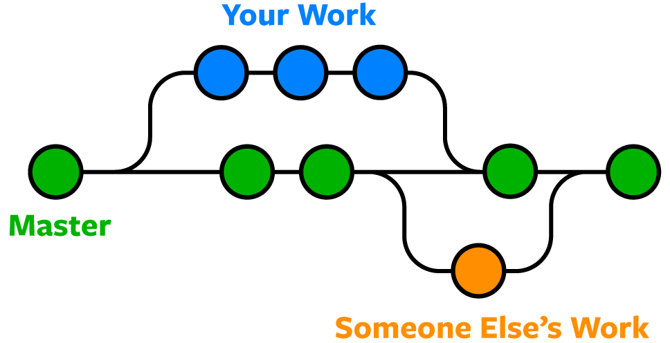

# **Introduction to Git and version control**

## 👀 **Оverview**

This tutorial provides an introduction to Git, including its basic concepts, benefits, and how it can be used for version control in Machine Learning projects. 

We will cover the basics of Git, such as creating a repository, making commits, branching, merging. Also, you can install Git and configure it for your machine at this stage. 

## 🎯 **Goals**

By the end of this tutorial you will: 
- understand what Git is and why it's important for ML development
- learn the basic concepts of version control, including repositories, commits, branches, and merges

## **1. What is Git and why is it important for ML development?**

[Git](https://git-scm.com/) is the most popular **version control system** in the world. And version control system records the changes made to our code over time in a special database. 

We can look at our project history and see who has made changes, what changes, when and why. And if we screw something up we can easily revert our project back to an earlier state.

<br>

<!-- <p style="text-align: center;">Git explained in 100 seconds</p> -->

<figure class="video_container">
  <iframe src="https://www.youtube.com/embed/hwP7WQkmECE" frameborder="0" width="600" height="300" allowfullscreen="true" "Image Title" > </iframe>
  <figcaption>
    Git explained in 100 seconds
    </figcaption>
</figure> 


Without a version control system we'll have to constantly store copies of the entire project in various folders. This is very slow and doesn't scale at all. Especially if multiple people have to work on the same project you would have to constantly toss around the latest code via email or some other mechanisms and then manually merge the changes.

So, with a version control system you can

- keep track of your code and files changes over time. So you have a record of what has been done, who made changes, and revert to specific versions
- collaborate easier, because Git allow merge changes of multiple people into one source
- experiment with different features and models without losing progress
- handle different versions of the same code at the same time
- take different versions of the same code, compare them, and assemble them together
- create your own copy of a collection of files to modify your copy and suggest changes


### **Why is Git important for machine learning development?**

Git as version control system is crucial in ML development, because it

- helps avoid pitfalls of manual version control such as overwriting important files or forgetting to make backups
- allows you to create and switch between branches, commit changes to that branches, merge changes from different sources, and track project evolution over time
- keeps code organized and easy to manage
- enables collaboration with other developers simultaneously without risking loss of progress
- facilitates collaboration between teams and remote workers by providing a repository to share code and track changes.
- enables rollbacks to previous versions of code, providing a safety net for testing new features or implementing changes.
- helps to resolve conflicts that may arise when multiple developers make changes to the same codebase.
- allows for easy monitoring of project history, including who made what changes and when, providing valuable insights into the development process.
- integrates with a wide range of other development tools and platforms, making it a flexible and versatile option for ML development teams.

## **2. Basic concepts of version control: repository, commit, branch, merge, etc.** 

To manage changes to code over time you should learn the basic concepts of version control. Here they are:

- **Repository:** A repository is a collection of files and folders that are managed by a version control system. It contains the entire history of the project, including all changes and versions of the code.
  
- **Commit:** A commit is a snapshot of the changes made to the code at a particular point in time It records the changes to the files in the repository, along with a message describing the changes.
  
- **Branch:**  It is a separate version of the code within the same repository, and changes made in the branch are tracked separately from the main "master" branch. Branches are useful for experimenting with new features or fixing bugs without affecting the main codebase.
  
- **Merge:** Merging is the process of combining two or more branches into a single branch. It allows developers to bring changes from one branch into another and resolve any conflicts that arise.

<figure markdown>
  { width="400" height="100" }
    <figcaption>
    Source: https://www.nobledesktop.com/learn/git/git-branches
    </figcaption>
</figure>


- **Fork:** A fork is a separate copy of the entire repository, including all its branches, commits, and history created by a user. It allows the user to experiment with the code without affecting the original repository. Forks are commonly used in open source projects, where users can contribute changes back to the original repository through pull requests.
- **Pull/Merge request (PR/MR)**: A pull request is a request to merge changes from one branch into another. So you send the code updates. Then, other people look on your code, discuss it in the GitLab/ GitHub, and decide whether to merge or not

These concepts are fundamental to version control systems like Git, and understanding them is essential for effective collaboration and development in software development teams.  

## **3. Git installation and configuring**

The first step in using Git is to install it on your machine and configure it. Here are the steps to follow:

1. Go to the official [Git website](https://git-scm.com/downloads) and download the appropriate version for your operating system.
2. Follow the installation instructions provided in the setup wizard.
3. Once installed, open a terminal or command prompt window and verify that Git was installed correctly by typing
   
```bash
git --version
# git version 2.40.1
```
4. Then you need to configure Git. 

Watch video tutorials below with the whole process of installation and configuration (for MacOS and Windows)

<figure class="video_container">
  <iframe src="https://www.youtube.com/embed/r3SgprWigBc" frameborder="0" width="600" height="300" allowfullscreen="true" "Image Title" > </iframe>
  <figcaption>
    Git installing and configuring on MacOS
    </figcaption>
</figure> 

<figure class="video_container">
  <iframe src="https://www.youtube.com/embed/j-g8AXr4nR4" frameborder="0" width="600" height="300" allowfullscreen="true" "Image Title" > </iframe>
  <figcaption>
     Git installing and configuring on Windows
    </figcaption>
</figure> 
5. Final step here is to create and add your SSH key
   
   Adding an SSH key to your Git configuration allows you to securely authenticate and interact with remote repositories without having to repeatedly enter your username and password.
   
   Follow the video tutorial below

<figure class="video_container">
  <iframe src="https://www.youtube.com/embed/Z3ELWci34cM" frameborder="0" width="600" height="300" allowfullscreen="true" "Image Title" > </iframe>
  <figcaption>
     Crerating and adding SSH key
    </figcaption>
</figure> 

## 🏁 **Conclusion**

Congratulations on completing this tutorial! 🥳 

By now, you should have a solid understanding of what Git is and why it is important for machine learning development. You have also learned the basic concepts of version control, including repositories, commits, branches, merges, merge request/pull request (MR/PR), and fork.

See you on the next step! 

## 🎓 **Additional resources and links for self-learning**

- **[Git documentation](https://git-scm.com/doc)**
- **[GitHub Guides](https://docs.github.com/en)**
- **[Atlassian Git tutorial](https://www.atlassian.com/git/tutorials)**
- **[Git cheat sheet](https://education.github.com/git-cheat-sheet-education.pdf)**
- Pro Git book: **[https://git-scm.com/book/en/v2](https://git-scm.com/book/en/v2)**

## 🚀 **Your Feedback is Important to the Community!**

Hey! We hope you enjoyed the tutorial and learned a lot of useful techniques 🔥

Please 🙏🏻  take a moment to fill out feedback form. We would appreciate any suggestions or comments you may have on how we can improve our tutorials and create better learning experiences for the whole community. 

<!-- Link to feedback form: **[Feedback Form](insert link here)** -->

[Feedback Form :fontawesome-solid-paper-plane:](https://forms.gle/Yc9DmampbwFpEzo58){ primary: #7f56c0 accent: #7f56c0; .md-button }

Thank you for taking the time to share your thoughts with us! 👍

