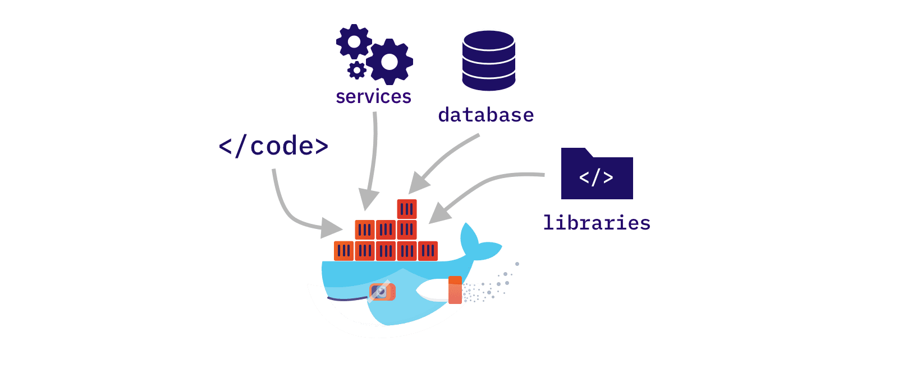
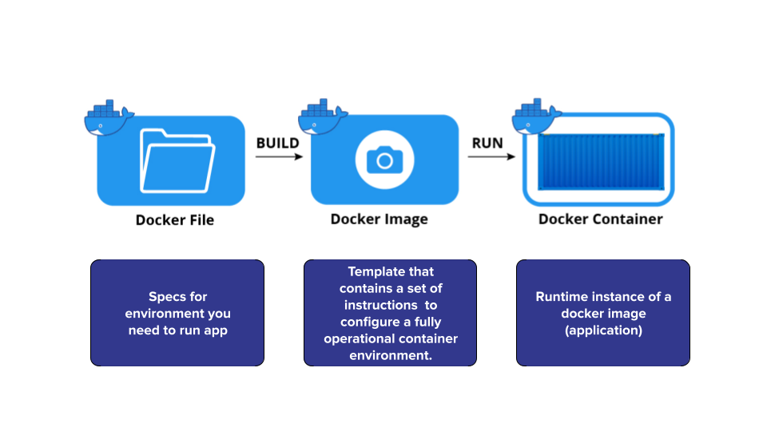
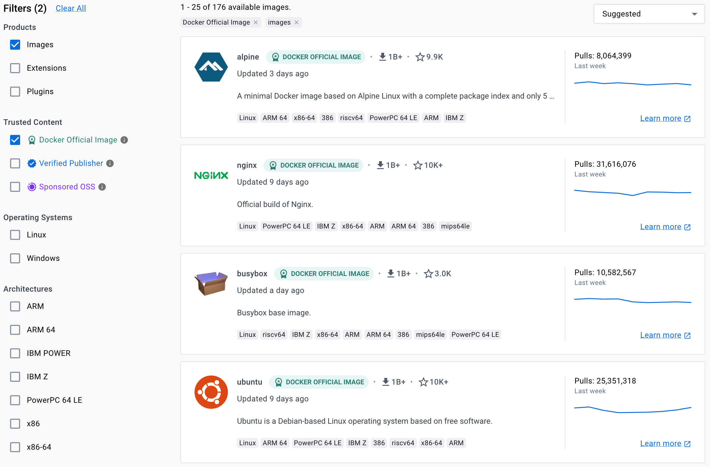
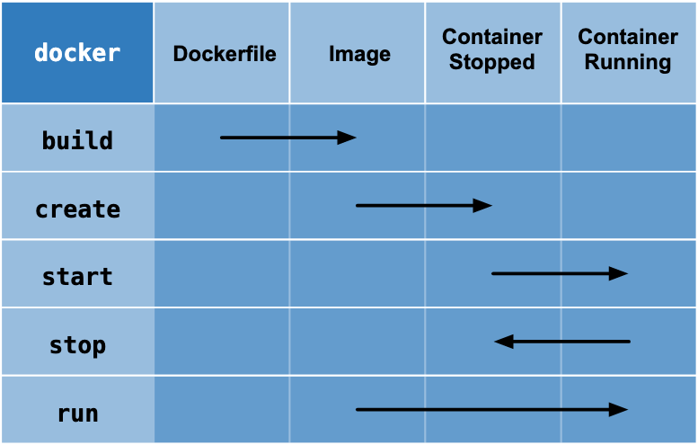
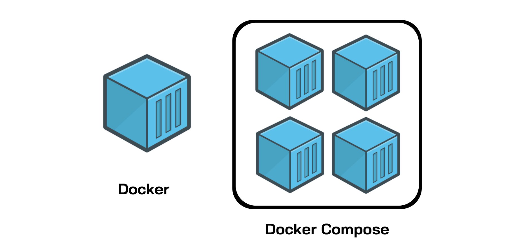

# Title: Docker

## **👀 Overview**

The module is designed to teach Machine Learning Engineers how to use Docker and Docker-compose, powerful tools that allow for the creation and deployment of containerized applications in a consistent and reproducible way. Learn how to use Docker to build reproducible environment, optimize Docker image size and build time, and ML models deployment.

## **🎯 Goals**

Learn how to: 

- Build a Docker image 
- Run Docker containers 
- Mount data and code into Docker container 
- Build and run Docker containers with docker-compose
- Share Docker images with Docker Hub and GitLab Registry
- Optimize Docker images

## **⚒️ Tutorial: Docker**

Docker is a powerful tool that helps developers package their software and all its dependencies into self-contained units known as Docker containers.

<figure markdown>
  {width="700" height="400"}
    <figcaption>
    Source: [What is Docker](https://accesto.com/blog/when-to-use-and-when-not-to-use-docker/)
    </figcaption>
</figure>

**Good reasons to use Docker**

1. **Consistent and Reproducible Environments:** Docker ensures that your ML models run consistently across different machines and environments.
2. **Easy Dependency Management:** Docker simplifies managing the specific versions of software components needed for your ML project.
3. **Scalability and Portability:** Docker containers are lightweight and portable, allowing you to easily scale and move your ML applications across different environments.
4. **Simplified Collaboration:** Docker enables team members to work with the same environment, facilitating collaboration and accurate reproduction of ML experiments.
5. **Streamlined Deployment with CI/CD:** Docker integrates smoothly with CI/CD pipelines, automating testing, building, and deployment of ML applications, and enhancing production deployments.

### **Key Concepts**

<figure markdown>
  {width="700" height="400"}
    <figcaption>
    </figcaption>
</figure>

Docker is an open platform for developing, shipping, and running applications.

- Container image (or Docker image) is a standardized unit of software that packages an application with all its dependencies - application code, runtime environment, system tools, libraries, and configurations.
- A container image becomes a container when we run it (e.g., execute `docker run`).

Example of a Typical Folder Structure

```markdown
.
├── Dockerfile    <- how to create a Docker image
├── Pipfile       <- pipenv
├── Pipfile.lock  <- pipenv
└── app.py        <- the application itself
```

### **Dockerfile**

A text file which contains a sequential set of all the commands or instructions that you want to include in your Docker Image of an application. Helps to:

- set the host OS (base image)
- write a list of packages you want to install
- add dependencies for your application
- set environmental variables
- provide the default command which the application will execute when the container will start executing

Example: 

```docker
FROM ubuntu:18.04
COPY . /app
RUN make /app
CMD python /app/app.py
```

Main Dockerfile statements:

| Command | Purpose |
| --- | --- |
| FROM | To specify the parent image. |
| WORKDIR | To set the working directory for any commands that follow. |
| RUN | To install applications and packages required for the container. |
| COPY | To copy files or directories from a specific location. |
| ADD | Similar to COPY, but can handle remote URLs and unpack files. |
| ENTRYPOINT | Command that always executes when the container starts. |
| CMD | Arguments passed to the entrypoint command. |
| EXPOSE | To define the port through which to access the container. |

### **Docker Hub**

[Docker Hub](https://hub.docker.com/) is a registry of Docker images that contains images uploaded by third-party developers as well as images released by Docker developers.
Find configured Docker images for different purposes, or store your own.

<figure markdown>
  {width="700" height="400"}
    <figcaption>
    Source: [Docker Hub](https://www.docker.com/blog/build-machine-learning-apps-with-hugging-faces-docker-spaces/)
    </figcaption>
</figure>

## **Get Started: workflow**

Take 10 minutes to follow the official tutorial: **[Get Started with Containerize an application](https://docs.docker.com/get-started/02_our_app/)**

<figure markdown>
  {width="500" height="200"}
    <figcaption>
    Source: [Docker workflow](https://weibeld.net/misc/docker-cheatsheet.html)
    </figcaption>
</figure>

Here is an explanation of the example "[Docker Hello World](https://hub.docker.com/_/hello-world)":

```bash
$ docker run hello-world
```

This command pulls the "hello-world" image from the Docker Hub registry and runs a container based on that image. The container displays a simple message to indicate that the Docker installation is working correctly.

```bash
$ docker ps -a
```

This command lists all containers, including both running and stopped containers. Running this command after executing the previous command will show the "hello-world" container in the list.

```bash
$ docker stop hello-world
```

This command stops the running "hello-world" container by sending a termination signal. The container will transition from a running state to a stopped state.

```bash
$ docker start hello-world
```

This command starts the stopped "hello-world" container. The container will transition from a stopped state to a running state.

The Docker Hello World example is a simple way to verify that your Docker installation is functioning properly. By running the container, you can confirm that Docker is able to pull images, create and manage containers, and execute applications within them.

### **Key Image Commands**

These commands are helpful for managing Docker images and containers during the development and deployment of applications.


### **Key Container Commands**


### **Container Volumes**

Container Volumes provide the ability to connect a folder inside the container to a folder on the host machine.

There are two types of Container Volumes


### **Container Volumes**

Creating a new Named Volume

```bash
 docker volume create new-volume
```

Passing it as an argument in the `docker run` command

```bash
 docker run -v new-volume:/etc/data image-name
```

## **🎼 Docker Compose**

Docker Compose is a tool that allows you to define and manage multi-container applications using a YAML file. With Docker Compose, you can easily specify the services, networks, and volumes required for your application and launch them with a single command.

<figure markdown>
  {width="500" height="200"}
    <figcaption>
    Source: [Docker Compose](https://www.educative.io/blog/docker-compose-tutorial)
    </figcaption>
</figure>

Check out an [official tutorial](https://docs.docker.com/get-started/08_using_compose/).

## **🏁 Conclusion**

Docker provides a powerful and efficient way to package and deploy applications, enabling consistent environments and facilitating the management of dependencies. It is widely used in the software development and deployment process, particularly in the context of microservices and containerization.

By understanding the principles and techniques covered in this overview, you can leverage Docker to streamline your development workflow, improve scalability, and enhance the portability of your applications.

## **🎓 Additional Resources**

- **[Docker Documentation](https://docs.docker.com/)**: The official documentation for Docker, providing comprehensive guides and references.
- **[Docker Hub](https://hub.docker.com/)**: The central repository for Docker images, where you can find a wide range of pre-built images.
- **[Dockerfile Reference](https://docs.docker.com/engine/reference/builder/)**: The reference guide for creating Docker images using Dockerfile.
- **[Docker Compose](https://docs.docker.com/compose/)**: A tool for defining and running multi-container Docker applications.
- [A Beginner’s Guide to Understanding and Building Docker Images by Edward Kisller](https://jfrog.com/knowledge-base/a-beginners-guide-to-understanding-and-building-docker-images/)

**Best practices for Docker**

- [Best practices for writing Dockerfiles](https://docs.docker.com/develop/develop-images/dockerfile_best-practices/)
- [Docker development best practices](https://docs.docker.com/develop/dev-best-practices/) (Docker docs)
- [How to fully utilise Docker during development](https://thestartupfactory.tech/journal/how-to-fully-utilise-docker-during-development)

**Docker Compose best practices**

- [Docker-compose Tricks and Best Practices](https://medium.com/factualopinions/docker-compose-tricks-and-best-practices-5e7e43eba8eb)
- [10 Tips for Docker Compose Hosting in Production](https://blog.cloud66.com/10-tips-for-docker-compose-hosting-in-production/)
- [How to fully utilise Docker-compose during development](https://thestartupfactory.tech/journal/how-to-fully-utilise-docker-compose-during-development)

****Demo projects & tools****

- docker-hub-ml-project [https://github.com/dockersamples/docker-hub-ml-project](https://github.com/dockersamples/docker-hub-ml-project)
- example-voting-app [https://github.com/dockersamples/example-voting-app](https://github.com/dockersamples/example-voting-app)
- Dive into Docker image layers with dive: [https://github.com/wagoodman/dive](https://github.com/wagoodman/dive)

!!! info " Contribute to the community! 🙏🏻 "

    Hey! We hope you enjoyed the tutorial and learned a lot of useful techniques 🔥 
    
    Please 🙏🏻 take a moment to improve our tutorials and create better learning experiences for the whole community. You could
 
    - ⭐ **Put a star on our [ML REPA library repository](https://github.com/mlrepa/mlrepa-library)** on GitHub
    - 📣 **Share our tutorials** with others, and
    - :fontawesome-solid-paper-plane: **Fill out the [Feedback Form](https://forms.gle/Yc9DmampbwFpEzo58)**
    We would appreciate any suggestions or comments you may have

    Thank you for taking the time to help the community! 👍

