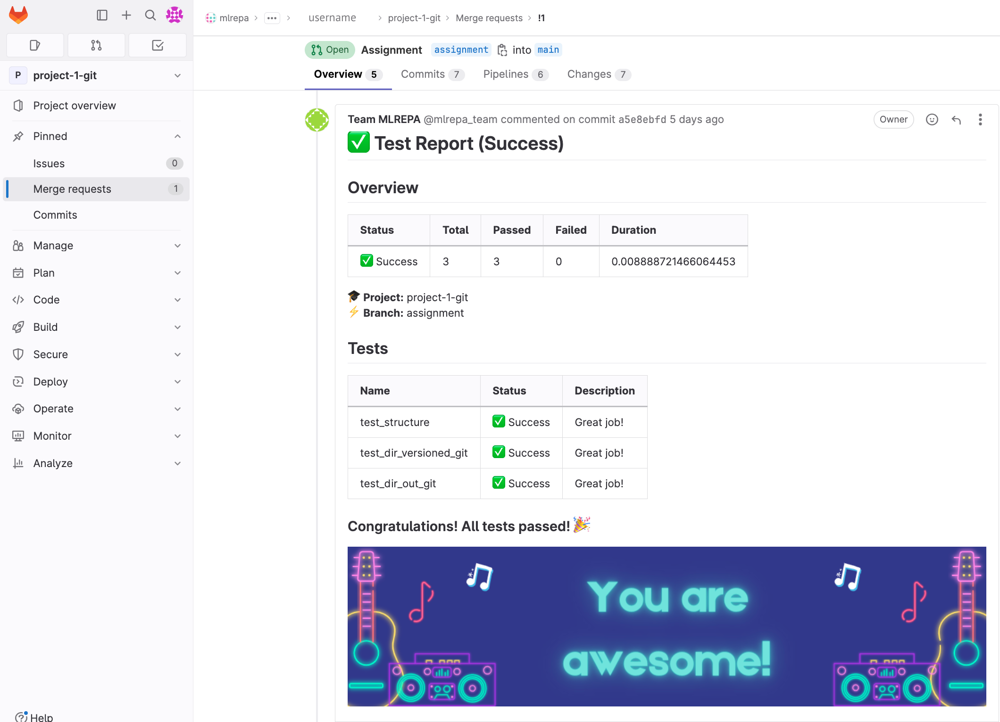

# Assignment 1: Setting up a Git Repository for an ML Project in GitLab

## 👀 **Overview**

This assignment is designed to provide hands-on practice with basic CLI, Git commands **and GitLab.** Throughout this assignment, you will clone a template repository and customize it to suit ML/AI projects.

By the end of the assignment, you will have created a template repository similar to the one generated by **[Cookiecutter Data Science](https://drivendata.github.io/cookiecutter-data-science/)**. This repository can be reused as a template for your future projects.

We will be using GitLab for this assignment.

## 🎯**Goals**

Upon completing this assignment, you will be able to:

- Effectively utilize Git commands
- Practice collaborative workflows using Git and Merge Requests
- Create a template repository for ML projects
- Gain hands-on experience with GitLab

Let's dive in and start setting up your Git repository!

## **Requirements**

To ensure the successful completion of the assignment, please make sure the following requirements are met:

- [x] The source branch name for the Merge Request is `assignment`.
- [x] The `data/` directory in GitLab only contains a `.gitignore` file  (files added here are **NOT** tracked by Git)
- [x] The `models/` directory in GitLab has an empty `.gitignore` file (files added here are tracked by Git)
- [x] The `reports/` directory in GitLab has an empty `.gitignore` (files added here are tracked by Git)
- [x] The `notebooks/` directory in GitLab only contains a `.gitignore` (files added here are **NOT** tracked by Git)
- [x] The root of your repository contains an empty `config.yaml` file.
- [x] *(optional)* The README.md file has been updated to provide an overview of the repository, including details about its purpose, structure, and usage instructions.

Good luck with your submission! 🙌🏻

## 👩🏻‍💻 **Assignment**

### **1. Clone the Repository**

!!! Note
    💡 Please, find the `project-1-git`repository in your workspace in the GitLab MLREPA Group.

Please clone this repository with the SSH URL to your local machine.

### **2. Create a New Branch: `assignment`**

Navigate to the cloned repository and create a new branch there named `assignment` and switch to it using the following command:

```bash
# Create a new branch and switch to it
git checkout -b assignment
```

!!! Note
    💡 It’s important to name the branch name exactly as an `assignment`.
    Other names or typos will affect the assessment results.

### **3. Add the  `data/` Directory**

In the process of working on your project, you may come across files or folders that are not meant to be included in Git version control, such as temporary files or large data files. These files can clutter your repository and make it more difficult to manage.

To address this, Git uses a `.gitignore` file to specify files and directories that should be ignored when committing changes.
Let's try it!

**Sub-task 1: Add the `data/` Directory and Exclude its Contents from Version Control**

First, inside your new `assignment` branch create an empty directory named `data/` with this command:

```bash
mkdir data
```

Next, create a `.gitignore` file in the root of your repository:

```bash
touch .gitignore
```

Update the `.gitignore` file to exclude the contents of the whole `data/` directory.

The asterisk (*) is a wildcard character that represents any file in the specified location.

```bash
# Add the following line
data/*
```

Commit your updates and push them in the remote repository

```bash
git add .gitignore
git commit -m "Add .gitignore file"
git push origin assignment
```

Note, at this point Git doesn’t track any files in the `data/` directory.

You can test this by creating a new file inside the `data/` directory and running the `git status` command. The output should not show any changes in the repository.

```bash
# Creating a file in untracked directory
touch data/file.txt 
# Git Status command shouldn't show any changes in the repo
git status 
```

However, if you check the remote repository on GitLab, you will notice that the `data/` directory is not present. This can become problematic if your colleagues clone your repository and expect the `data/` directory to be present.

It is a good practice to keep the repository structure consistent between your local and remote repositories.
Let's address this issue!

**Sub-task 2: Make `data/` directory visible in GitLab remote**

To make the `data/` directory visible in the GitLab remote repository without versioning all files inside it, we can create a hidden file inside the directory and instruct Git to track only that single file.

First, let's create an empty `.gitignore` file in the `data/` directory:

```bash
# Create ".gitignore" file in "data/" directory
touch data/.gitignore
```

Next, add `data/.gitignore` to Git by appending the following line to the file:

```bash
echo '!.gitignore' >> data/.gitignore
```

Then, add `data/.gitignore` to Git using the force mode. 

By using the `-f` flag, you're instructing Git to forcefully add the `.gitignore` file to the staging area, regardless of any ignore rules defined.

```bash
git add data/.gitignore -f
```

Commit and push the updates to the remote repository:

```bash
git commit -m "Add `data/.gitignore` file"
git push origin assignment
```

By following these steps, you will achieve the following expected results:

- The `file.txt` inside the `data/` directory will not be added to the Git history.
- The `data/` directory will be visible in the GitLab remote repository.

This approach allows you to exclude specific files from version control while still making the directory itself visible in the remote repository. It helps maintain consistency between your local and remote repositories and ensures that your colleagues can access and use the necessary directory structure for your ML project.

### **4. Add `models/` directory**

The `models/` directory is used to store trained and serialized models. To add this directory to the repository and track its content with Git, please complete the following tasks:

**TODO:** 

- [x]  Add the `models/` directory to the repository.
- [x]  Create a `.gitignore` file inside the `models/` directory
- [x]  Ensure that the content within the `models/` directory is tracked by Git.

### **5. Add `reports/` directory**

The `reports/` directory is intended for storing metrics, generated graphics, and figures used for reporting purposes. To complete the task, follow these steps:

**TODO:** 

- [x]  Add the `reports/` directory to the repository.
- [x]  Create a `.gitignore` file inside the `reports/` directory
- [x]  Ensure that the content within the `reports/` directory is tracked by Git.

### **6. Add `notebooks/` directory**

The `notebooks/` directory is used for storing Jupyter Notebook files, often utilized for prototyping purposes. To follow best practices, we should exclude these files from being tracked by Git.

**TODO:**

- [x]  Add the `notebooks/` directory to the repository.
- [x]  Exclude the contents of the whole `notebooks/` directory. 
For this update the `.gitignore` file in the root of your repository
- [x]  But make `notebooks**/`** directory visible in GitLab remote. To do this you should
    * [x] create a `.gitignore` file inside the `notebooks/` directory.
    * [x] append the same following line to the .gitignore file:

    ```bash
    echo '!.gitignore' >> notebooks/.gitignore
    ```

- [x]  Ensure that the content within the `notebooks/` directory is not tracked by Git.

### **7. Add the `requirements.txt` file**

It is considered good practice to list all the Python dependencies required for the project in a `requirements.txt` file. For this template, we will add an empty file.

**TODO:** 

- [x]  Add an empty `requirements.txt` file to the “project-1-git” repository.

### **8.  Add the `config.yaml` file**

Add the `config.yaml` file in the root of your repository. 
The `config.yaml` file is used to store configuration settings and parameters for a particular application or system.

For now `config.yaml` file will remain empty. 

### **9. *(optional)* Update the `README.md` file**

It is recommended to have a `README.md` file that provides an overview of the repository, including details about its purpose, structure, and instructions for usage.

**To do**

- [x]  Create the`README.md` file

### **10. Commit and Push Updates to the `assignment` Branch on GitLab**

```bash
git push origin assignment
```

### **11. Сheck the Requirements to the assignment**

Check your assignment for the requirements at the beginning of the page. Make sure everything is correct.

???+ success

    **Requirements**
    
    To ensure the successful completion of the assignment, please make sure the following requirements are met:
    
    - [x] The source branch name for the Merge Request is `assignment`.
    - [x] The `data/` directory in GitLab only contains a `.gitignore` file  (files added here are **NOT** tracked by Git)
    - [x] The `models/` directory in GitLab has an empty `.gitignore` file (files added here are tracked by Git)
    - [x] The `reports/` directory in GitLab has an empty `.gitignore` (files added here are tracked by Git)
    - [x] The `notebooks/` directory in GitLab only contains a `.gitignore` (files added here are **NOT** tracked by Git)
    - [x] The root of your repository contains an empty `config.yaml` file.
    - [x] **(optional)** The README.md file has been updated to provide an overview of the repository, including details about its purpose, structure, and usage instructions.

### **12. Submission: Create a Merge Request to the `main` Branch**

Once you have completed all the tasks and are ready to submit your assignment, follow the steps below to create a Merge Request to the **`main`** branch:

1. Go to the GitLab repository page.
2. Click on the "Merge Requests" tab.
3. Click on the "New Merge Request" button.
4. Set the source branch to `assignment` and the target branch to `main`.
5. Provide a title and description for your Merge Request.
6. Review the changes and make sure everything looks correct.
7. Click on the "Submit Merge Request" button.

???+ warning

        Please DO NOT MERGE your request until you receive a submission report attached to your 
        Merge Request. 

        - Creating a merge request will trigger a CI pipeline that automatically checks our work.
        - A test report will be generated and added to your merge request.
        - This report will contain the results of the automated tests and checks on your assignment.
        - After passing all tests, you may proceed with merging the updates into the `main` branch.

Submission report looks like this



## **Pro Tips**

### **1. Use and share the template**

Congratulations on completing the assignment! You have successfully created a Git Repo Template that can be used for new projects. Simply fork or clone the template, rename it, and start using it in your future project

### **2. Use VSCode IDE to generate `.gitignore` files**

VSCode IDE provides a handy option to generate  `.gitignore` file for Python language: 

- press `CTRL + Shift + P` (`CMD + Shift + P` on macOS) to open the command palette.
- type in `Add gitignore` in the command palette.
- Update code & commit

